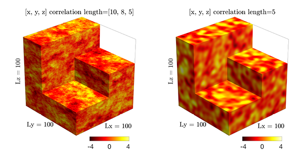

# ParallelRandomFields.jl
Efficient parallel random field generator for large 3-D problems



ParallelRandomFields enables to sample spatial realisations of a 3-D random fields with given power spectrum. The method allows for fast and accurate generation of Gaussian random fields with anisotropic exponential (left figure pane) and isotropic Gaussian (right figure pane) covariance functions. The method is fast, accurate and fully local. We use [ParallelStencil.jl] to provide an architecture-agnostic high-level CPU and GPU implementation, and [ImplicitGlobalGrid.jl] for multi-XPU support (distributed memory parallelisation).

The implementation builds upon an approach proposed in \[[1][Raess2019]\] and employs a parallel implementation of the method based on spectral representation described in \[[2][Sabelfeld1991]\]. Advantages of this method are the possibility of random field simulation on an arbitrary grid and the simplicity of parallel implementation of the algorithm. The method is flexible and is also applicable for arbitrary anisotropic spectrum.


ParallelRandomFields.jl is the Julia version with additional multi-XPU support of the original CUDA C implementation published in Computers & Geosciences:
```tex
@article{rass2019grf,
    title={Efficient parallel random field generator for large 3-D geophysical problems},
    author={R{\"a}ss, Ludovic and Kolyukhin, Dmitriy and Minakov, Alexander},
    journal={Computers \& Geosciences},
    volume={131},
    pages={158--169},
    year={2019},
    publisher={Elsevier}
}
```

## Content
* [Development status](#development-status)
* [Module documentation callable from the Julia REPL / IJulia](#module-documentation-callable-from-the-julia-repl--ijulia)
* [Usage](#usage)
* [Dependencies](#dependencies)
* [Installation](#installation)
* [Questions, comments and discussions](#questions-comments-and-discussions)
* [References](#references)

## Development status
**Disclaimer: This section lists the current status and the ideas on how to design the module. All further sections of the README are work in progress and not finalised yet, mainly reflecting potential infos to share.**

The trial for the module is currently done only with the 2D random field generator using the exponential covariance function. The goal is to include all the generation scripts in the module.


### Repository content

The following scripts are currently uploaded:
- `scripts` folder which contains the 2D, 3D and multi-XPU 3D routines as "monolithic" and standalone working codes. The `runme.jl` also within this folder should serve as script to call the _on-work_ module.
- `src` folder contains the source files for the module: the module itself `ParallelRandomFields.jl`, a random field generator `generate_RndField2D_expon.jl` that calls the specific random field routine e.g. `RndField2D_expon.jl` for creating a 2D Gaussian random field with exponential covariance. 

### Design idea - not yet fully implemented nor working

The idea is to expose two functions or routines via the module:

1. a random field generator function (here `RndField2D_expon.jl`) that actually generates a specific random field (2D or 3D, exponential or Gaussian covariance). This function could be called within the main of a ParallelStencil-enabled code as `# Initial condition`. 

The function `RndField2D_expon!()` should take an initialised `Yf::Data.Array` as input and return it as a random field for further calculations. 
```julia
RndField2D_expon!(Yf::Data.Array, sf::Data.Number, cl, nh::Int, nx::Int, ny::Int, dx::Data.Number, dy::Data.Number; do_reset=true)
```   

2. The module should provide a "higher-level" function, defined in `generate_RndField2D_expon.jl`, that permits a "stand-alone" initialisation of a random field, to be plotted, exported, or saved to disk. The function `generate_RndField2D_expon()` should thus initialise `ParallelStencil` and `ImplicitGlobalGrid` depending on the parameters, initialise the `Yf::Data.Array`, prepare for plotting, call the random field routine `RndField2D_expon!()` and return the random field either as array within interactive REPL, plot it, save it to disk or else.
```julia
generate_RndField2D_expon(lx::Data.Number, ly::Data.Number, sf::Data.Number, cl, nh::Int, nx::Int, ny::Int, dx::Data.Number, dy::Data.Number; do_viz=false, do_save=false, do_reset=true)
```

My goal was then to create a `runme.jl` that would "mimic" what a user should provide to `generate_RndField2D_expon()` function in order to initialise a random field.

I think it makes sense to expose two functionalities, one being a "stand-alone" generator where only input are physics, and one being the core random field computing routine that could be called as simple function within a ParallelStencil-enabled code when the users knows what he does.

I still have problems to see how to package all this in Julia:
- especially if a `shared.jl` module is needed to handle the boolean such as `USE_GPU`, `GPU_ID`, and the optionnal arguments (`do_viz`, `do_save`, `do_reset`, etc...).
- how to best handle that one can deal with 2D, 3D, 3D multi-XPU and for each case, there are both the exponential and Gaussian field available
- `ParallelStencil being not yet registered, this causes minor issue when having it as dependency in another package since the `resolve` will fail...


## Module documentation callable from the Julia REPL / IJulia
The module documentation can be called from the [Julia REPL] or in [IJulia]:
```julia-repl
julia> using ParallelRandomFields
julia>?
help?> ParallelRandomFields
```

## Usage
ParallelRandomFields can be interactively executed within the [Julia REPL]. Note that for optimal performance the script should be launched from the shell using the project's dependencies `--project`, disabling array bound checking `--check-bounds=no`, and using optimization level 3 `-O3`.
```sh
$ julia --project --check-bound=no -O3 <script>.jl
```

Note: refer to the documentation of your Supercomputing Centre for instructions to run Julia at scale. Instructions for running on the Piz Daint GPU supercomputer at the [Swiss National Supercomputing Centre](https://www.cscs.ch/computers/piz-daint/) can be found [here](https://user.cscs.ch/tools/interactive/julia/) and for running on the octopus GPU supercomputer at the [Swiss Geocomputing Centre](https://wp.unil.ch/geocomputing/octopus/) can be found [here](https://gist.github.com/luraess/45a7a4059d8ace694812e7e301f1a258).

## Dependencies
ParallelRandomFields relies on [ParallelStencil.jl] and [ImplicitGlobalGrid.jl], which build upon [CUDA.jl] and [MPI.jl].

## Installation
ParallelRandomFields may be installed directly with the [Julia package manager](https://docs.julialang.org/en/v1/stdlib/Pkg/index.html) from the REPL:
```julia-repl
julia>]
  pkg> add https://github.com/luraess/ParallelRandomFields.jl
```

## Questions, comments and discussions
To discuss technical issues, please post on Julia Discourse in the [GPU topic] or the [Julia at Scale topic].
To discuss numerical/domain-science issues, please post on Julia Discourse in the [Numerics topic] or the [Modelling & Simulations topic] or whichever other topic fits best your issue.

## References
\[1\] [Räss, L., Kolyukhin D., and Minakov, A., 2019. Efficient parallel random field generator for large 3-D geophysical problems. Computers & Geosciences, 131, 158-169.][Raess2019]

\[2\] [Sabelfeld, K.K., 1991. Monte Carlo Methods in Boundary Value Problems. Springer.][Sabelfeld1991]

[Raess2019]: https://doi.org/10.1016/j.cageo.2019.06.007
[Sabelfeld1991]: https://cds.cern.ch/record/295430
[ParallelStencil.jl]: https://github.com/omlins/ParallelStencil.jl
[ImplicitGlobalGrid.jl]: https://github.com/eth-cscs/ImplicitGlobalGrid.jl
[MPI.jl]: https://github.com/JuliaParallel/MPI.jl
[CUDA.jl]: https://github.com/JuliaGPU/CUDA.jl
