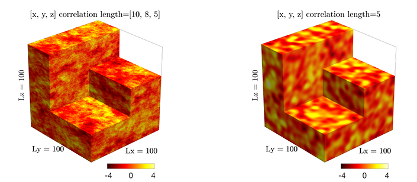

# ParallelRandomFields.jl
Efficient multi-XPU parallel random field generator for large 2D and 3D problems



ParallelRandomFields enables to sample spatial realisations of 2D or 3D random fields with given power spectrum. The method allows for fast and accurate generation of Gaussian random fields with anisotropic exponential (left figure pane) and isotropic Gaussian (right figure pane) covariance functions. The method is fast, accurate and fully local. We use [ParallelStencil.jl] to provide an architecture-agnostic high-level CPU and GPU implementation, and [ImplicitGlobalGrid.jl] for multi-XPU support (distributed memory parallelisation).

The implementation builds upon an approach proposed in \[[1][Raess2019]\] and employs a parallel implementation of the method based on spectral representation described in \[[2][Sabelfeld1991]\]. Advantages of this method are the possibility of random field simulation on an arbitrary grid and the simplicity of parallel implementation of the algorithm. The method is flexible and is also applicable for arbitrary anisotropic spectrum.


ParallelRandomFields.jl is the Julia version with additional multi-XPU support of the original CUDA C implementation [accessible here](https://bitbucket.org/lraess/grfs/src/master/), published in Computers & Geosciences:
```tex
@article{raess2019grf,
    title = {Efficient parallel random field generator for large 3-D geophysical problems},
    journal = {Computers & Geosciences},
    volume = {131},
    pages = {158-169},
    year = {2019},
    issn = {0098-3004},
    doi = {https://doi.org/10.1016/j.cageo.2019.06.007},
    url = {https://www.sciencedirect.com/science/article/pii/S0098300418309944},
    author = {Ludovic Räss and Dmitriy Kolyukhin and Alexander Minakov},
    keywords = {Geophysics, Geostatistics, Seismology, Computational methods, Parallel and high-performance computing}
}
```

## Content
* [Module documentation callable from the Julia REPL / IJulia](#module-documentation-callable-from-the-julia-repl--ijulia)
* [Usage](#usage)
* [Supported backends](#supported-backends)
* [Multi-XPU implementation](#multi-xpu-implementation)
* [Dependencies](#dependencies)
* [Installation](#installation)
* [Development status](#development-status)
* [Questions, comments and discussions](#questions-comments-and-discussions)
* [References](#references)


## Module documentation callable from the Julia REPL / IJulia
The module documentation can be called from the [Julia REPL] or in [IJulia]:
```julia-repl
julia> using ParallelRandomFields

julia>?

help?> ParallelRandomFields
search: ParallelRandomFields

  Module ParallelRandomFields

  Enables to sample spatial realisations of 2D and 3D Gaussian random fields with given power spectrum using follwoing
  covariance functions:

    •    anisotropic exponential

    •    isotropic Gaussian

  ParallelRandomFields can be deployed on both (multi-) GPUs and CPUs.

  General overview and examples
  ≡≡≡≡≡≡≡≡≡≡≡≡≡≡≡≡≡≡≡≡≡≡≡≡≡≡≡≡≡≡≡

  https://github.com/luraess/ParallelRandomFields.jl

  Functions are defined in the submodules.

  Submodules
  ≡≡≡≡≡≡≡≡≡≡≡≡

    •    ParallelRandomFields.grf2D_Threads

    •    ParallelRandomFields.grf3D_Threads

    •    ParallelRandomFields.grf2D_CUDA

    •    ParallelRandomFields.grf3D_CUDA

  To see a description of a function type ?<functionname>.
```


## Usage
Parallel random fields can be interactively generated within the [Julia REPL] using the 2D or 3D generator functions `generate_grf2D()`, `generate_grf3D()` available from the selected submodule depending on the number of dimensions (2D, 3D) and backend (`Threads`, `CUDA`). Consult the submodule and function documentation callable from the [Julia REPL] or in [IJulia] for further details.

To generate a 2D Gaussian random field with exponential anisotropic covariance function, type following in the [Julia REPL]:
```julia-repl
julia> using ParallelRandomFields

julia> using ParallelRandomFields.grf2D_Threads

julia> generate_grf2D();
```

### Main functionalities
- The 2D generator function `generate_grf2D()` calls random field realisation functions `grf2D_expon!()` (exponential covariance) and `grf2D_gauss!()` (Gaussian covariance) on the chosen backend (CPU/GPU).

- The 3D generator function `generate_grf3D()` calls random field realisation functions `grf3D_expon!()` (exponential covariance) and `grf3D_gauss!()` (Gaussian covariance) on the chosen backend (CPU/GPU).

- The random field realisation functions (`grf2D_expon!()`, `grf2D_gauss!()`, `grf3D_expon!()`, `grf3D_gauss!()`) can be used within user-specific external code using [ParallelStencil] to generate random fields ([see this example](scripts/runme2D_Threads.jl)).

---

💡 Besides the module functionalities, the [scripts/](scripts/) folder contains:
- an [`runme2D_Threads.jl`](scripts/runme2D_Threads.jl) code that provides an explicit example of implementing the 2D random field realisation functions (`grf2D_expon!()`, `grf2D_gauss!()`) on the default `Threads` backend;

- the folder [ParallelRandomFields_multixpu/](scripts/ParallelRandomFields_multixpu) contains the multi-XPU sub-project **to be incorporated soon to the main module**;

- the folder [standalone_scripts/](scripts/standalone_scripts) contains standalone "monolithic" random field generator scripts (originally used prior to creating the ParallelRandomFields module).


## Supported backends
ParallelRandomFields builds upon [ParallelStencil.jl] and thus supports the default `Threads` backend as well as the `CUDA` backend for GPU acceleration. Multi-threading is enabled upon export of the [JULIA_NUM_THREADS] variable.


## Multi-XPU implementation
The advantage of the iterative random field generation algorithm is the trivial distributed memory parallelisation. The generation algorithm does not perform any communication among neighbouring cells nor global operations making it highly suitable for an efficient distributed memory parallelisation implementation using [ImplicitGlobalGrid.jl] (relying on [MPI.jl] and [CUDA.jl] for CUDA-aware MPI features).

🚧 The multi-XPU routines are not yet part of the main module but fully operational and accessible [here](scripts/ParallelRandomFields_multixpu) - WIP.

Note: refer to the documentation of your Supercomputing Centre for instructions to run Julia at scale. Instructions for running on the Piz Daint GPU supercomputer at the [Swiss National Supercomputing Centre](https://www.cscs.ch/computers/piz-daint/) can be found [here](https://user.cscs.ch/tools/interactive/julia/) and for running on the octopus GPU supercomputer at the [Swiss Geocomputing Centre](https://wp.unil.ch/geocomputing/octopus/) can be found [here](https://gist.github.com/luraess/45a7a4059d8ace694812e7e301f1a258).


## Dependencies
ParallelRandomFields relies on:
- [`ParallelStencil.jl`](https://github.com/omlins/ParallelStencil.jl) which builds upon [CUDA.jl] for GPU support
- [`ImplicitGlobalGrid.jl`](https://github.com/eth-cscs/ImplicitGlobalGrid.jl) which build upon [MPI.jl]
- [`MAT.jl`](https://github.com/JuliaIO/MAT.jl) and [`Plots.jl`](https://github.com/JuliaPlots/Plots.jl) are required for saving and visualisation purposes.


## Installation
ParallelRandomFields may be installed directly with the [Julia package manager](https://docs.julialang.org/en/v1/stdlib/Pkg/index.html) from the [Julia REPL]:
```julia-repl
julia> ]

(ParallelRandomFields) pkg> add https://github.com/luraess/ParallelRandomFields.jl
```


## Development status
This section lists the current development status of the module.

🚧 **TODOs**
- Move the multi-XPU "standalone" implementation to within the module
- Enhance documentation 


## Questions, comments and discussions
To discuss technical (multi-) GPU issues, please post on Julia Discourse in the [GPU topic] or the [Julia at Scale topic].
To discuss numerical/domain-science issues, please post on Julia Discourse in the [Numerics topic] or the [Modelling & Simulations topic] or whichever other topic fits best your issue.


## References
\[1\] [Räss, L., Kolyukhin D., and Minakov, A., 2019. Efficient parallel random field generator for large 3-D geophysical problems. Computers & Geosciences, 131, 158-169.][Raess2019]

\[2\] [Sabelfeld, K.K., 1991. Monte Carlo Methods in Boundary Value Problems. Springer.][Sabelfeld1991]


[Raess2019]: https://doi.org/10.1016/j.cageo.2019.06.007
[Sabelfeld1991]: https://cds.cern.ch/record/295430
[ParallelStencil.jl]: https://github.com/omlins/ParallelStencil.jl
[ImplicitGlobalGrid.jl]: https://github.com/eth-cscs/ImplicitGlobalGrid.jl
[MPI.jl]: https://github.com/JuliaParallel/MPI.jl
[CUDA.jl]: https://github.com/JuliaGPU/CUDA.jl
[Julia REPL]: https://docs.julialang.org/en/v1/stdlib/REPL/
[IJulia]: https://github.com/JuliaLang/IJulia.jl
[JULIA_NUM_THREADS]:https://docs.julialang.org/en/v1.0.0/manual/environment-variables/#JULIA_NUM_THREADS-1
[GPU topic]: https://discourse.julialang.org/c/domain/gpu/
[Julia at Scale topic]: https://discourse.julialang.org/c/domain/parallel/
[Numerics topic]: https://discourse.julialang.org/c/domain/numerics/
[Modelling & Simulations topic]: https://discourse.julialang.org/c/domain/models
